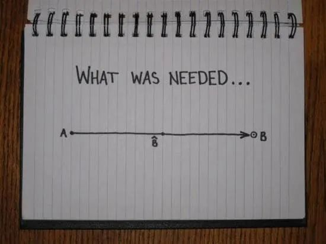

## 你的估计需要乘以 π

有一种说法，你的预估乘以 π，就会得到真实的估计。

这种说法有一定的道理，我可以用数学证明给大家看。

一切顺利的情况下，从 A 点到 B 点的路线是一条直线。没有遇到困难时，就是两点之间直线最短。

但是现实中，很多事情都是不顺利的。你会遇到各种各样的困难，你会迷失方向，路线不可能是直线，而是曲线。

平均来说，实际的路线长度往往是理想路线的 π 倍。

这意味着，你预估一件事的难度是1，实际难度可能是3；你预估需要一个月完成的项目，实际需要的时间可能是三个月。